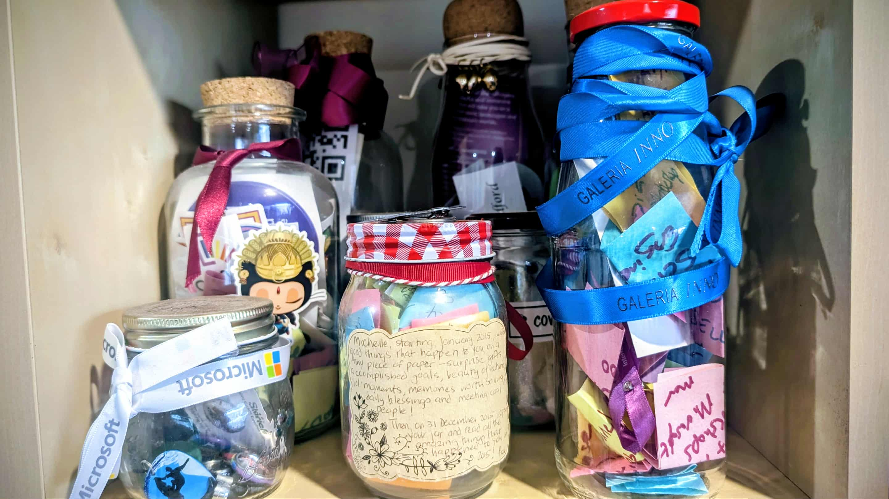

# 😨 Imposter Syndrome

Imposter Syndrome is the feeling that you don't belong or aren't good enough, even when you are! Many Pythonistas experience this at some point in their journey.  

---

## 💡 What is Imposter Syndrome?

Imposter Syndrome is is a psychological phenomenon where people doubt their skills, talents, or accomplishments and have a persistent fear of being exposed as frauds.  

There are five types of imposter syndrome, according to researcher Dr. Valerie Young:  

- **The Perfectionist:** This type involves believing that you could have done better, unless you were absolutely perfect.  
- **The Expert:** This type involves feeling like a fraud because you don’t know everything there is to know about a subject or topic.  
- **The Natural Genius:** This type involves feeling like a fraud because you don’t believe that you are naturally intelligent or competent.  
- **The Soloist:** This type involves feeling like a fraud if you had to ask for help to reach a certain level or status.  
- **The Superperson:** This type involves feeling like a fraud because you are trying to excel in multiple roles, such as work, family, and personal life.

It can affect anyone and they may experience anxiety, depression, low self-confidence, and frustration. 

Often people attribute their success to luck, timing, or deceiving others, rather than their own abilities.  

Now as I get older, I worry less about what other people think. But I still remember how hard it was earlier in my career to ask for help and how much it would have helped me if I had someone I could turn to without judgement.  
[and by earlier in my career, I mean yesterday…]

---

## 🛠️ How to Overcome

- **Recognize your achievements** - Keep a success journal
- **Talk to peers and mentors** - Share your feelings openly
- **Celebrate small wins** - Keep a Happiness Jar. Each time something good happens put a keepsake in the jar, or write a note on a brightly coloured postit. I save stickers, tickets, ribbons, buttons, pins, badges all sorts of little memories. 
- **Remember: You are not alone!** - This affects up to 70% of people  

---

## ➡️ Next: [The Expert](the-expert.md)
