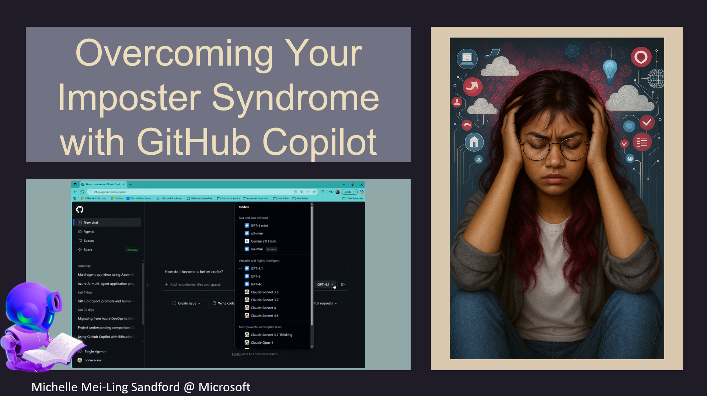

# 👋 Welcome to my PyCon Thailand Workshop  
**By Michelle Sandford From Microsoft Asia**  

Explore the journey through Imposter Syndrome and out the other side! Discover your strengths as a Pythonista. Navigate each chapter to learn, reflect, and grow!

---

## 📚 Chapters

- [Imposter Syndrome](imposter-syndrome.md) - That voice inside your head that holds you back from opportunity is not your friend!
- [The Expert](the-expert.md) - You don't need to know everything
- [The Perfectionist](the-perfectionist.md) - Progress over perfection
- [The Superperson](the-superperson.md) - Balance is key
- [The Natural Genius](the-natural-genius.md) - Learning takes time
- [The Soloist](the-soloist.md) - Collaboration is strength
- [Key Takeaways](key-takeaways.md) - What we've learned
- [Resources](resources.md) - Continue your journey
- [Contact Page](contact.md) - Stay connected

---

## 🚀 Get Started

Select a chapter from the navigation to begin your workshop journey.