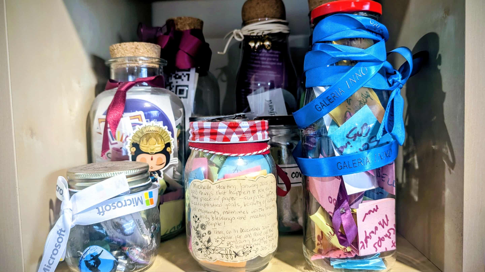

# 😨 Imposter Syndrome

Imposter Syndrome is the feeling that you don't belong or aren't good enough, even when you are! Many Pythonistas experience this at some point in their journey.  

---

## 💡 What is Imposter Syndrome?

# 😨 ซินโดรมผู้แอบอ้าง

ภาวะ Imposter Syndrome คือความรู้สึกว่า “เราไม่คู่ควร” หรือ “เราไม่เก่งพอ” ทั้งที่ความจริงแล้วคุณเก่งและมีคุณค่าอยู่แล้ว!
หลายคนในกลุ่ม Pythonista ต่างก็เคยรู้สึกแบบนี้ในบางช่วงของเส้นทางการเรียนรู้เช่นกัน 💡

---

## 💡 ซินโดรมผู้แอบอ้างคืออะไร?

Imposter Syndrome หรือ ภาวะผู้แอบอ้าง คือความรู้สึกว่าตัวเองไม่เก่งพอ ไม่คู่ควรกับความสำเร็จที่มี — แม้ในความเป็นจริงคุณจะมีความสามารถและทำได้ดีอยู่แล้วก็ตาม

คนที่มีภาวะนี้มักจะสงสัยในทักษะ ความสามารถ หรือความสำเร็จของตัวเอง และกลัวอยู่ตลอดเวลาว่าสักวันหนึ่งคนอื่นจะ “จับได้” ว่าตัวเองไม่เก่งจริง

เคยรู้สึกไหมว่า แม้จะประสบความสำเร็จมากแค่ไหน ก็ยังรู้สึกว่า “แค่โชคดี” หรือ “ยังไม่ดีพอ”?
ถ้าใช่... คุณอาจกำลังเผชิญกับ Imposter Syndrome อยู่ก็ได้

ความรู้สึกแบบนี้อาจดูเล็กน้อย แต่เมื่อสะสมไปเรื่อย ๆ มันสามารถกระทบกับการทำงาน การเรียน และความมั่นใจในชีวิตได้อย่างมาก บางคนถึงขั้นพัฒนาไปสู่ภาวะซึมเศร้าโดยไม่รู้ตัว โดยเฉพาะในสังคมที่เต็มไปด้วยการแข่งขันและแรงกดดันสูง

### ประเภทของ Imposter Syndrome (ดร. วาเลอรี ยัง)

นักวิจัยชื่อ ดร. วาเลอรี ยัง (Dr. Valerie Young) ได้แบ่งภาวะนี้ออกเป็น 5 ประเภทหลัก ได้แก่
- **นักสมบูรณ์แบบ (The Perfectionist)** เชื่อว่าทุกอย่างต้องไร้ที่ติ ถ้าไม่สมบูรณ์แบบ ก็รู้สึกว่าตัวเองล้มเหลว
- **ผู้เชี่ยวชาญ (The Expert)** รู้สึกว่า “ยังรู้น้อยเกินไป” ตลอดเวลา และจะไม่กล้าแสดงออกจนกว่าจะรู้ทุกอย่าง
- **อัจฉริยะโดยธรรมชาติ (The Natural Genius)** ถ้าเรียนรู้สิ่งใดได้ช้า จะรู้สึกว่าตัวเองไม่ฉลาดพอ
- **นักทำงานเดี่ยว (The Soloist)** เชื่อว่าต้องทำทุกอย่างด้วยตัวเอง ถ้าขอความช่วยเหลือคือ “อ่อนแอ”
- **ซูเปอร์ฮีโร่ (The Superperson)** พยายามทำทุกอย่างให้ดี ทั้งงาน ครอบครัว และชีวิตส่วนตัว จนสุดท้ายเหนื่อยล้าและรู้สึกว่าตัวเองยัง “ไม่พอ”

ภาวะผู้แอบอ้างสามารถเกิดขึ้นได้กับทุกคน ไม่ว่าจะเป็นนักเรียน เด็กจบใหม่ พนักงานมืออาชีพ หรือแม้แต่คนดังระดับโลก หลายคนเชื่อว่าความสำเร็จของตนเกิดจาก “โชค” หรือ “จังหวะเวลา” มากกว่าความสามารถของตัวเอง

โดยทั่วไปแล้ว ภาวะนี้สามารถเกิดขึ้นได้กับทุกคน
แต่จะพบได้บ่อยในคนที่มีความสามารถสูง หรือประสบความสำเร็จในระดับหนึ่งอยู่แล้ว
เช่น นักวิชาการ นักคิด คนทำงานเก่ง ๆ เด็กจบใหม่
หรือคนที่เปลี่ยนงานบ่อย รวมถึงบุคคลที่มีชื่อเสียงระดับโลกก็ยังเป็นได้

หลายคนมักเชื่อว่าความสำเร็จของตัวเองเกิดจาก “โชคดี” “จังหวะเวลา”
หรือ “การทำให้คนอื่นเข้าใจผิด” มากกว่าจะยอมรับว่ามันมาจากความสามารถของตนเองจริง ๆ

ตอนนี้เมื่อฉันโตขึ้น ฉันไม่ค่อยกังวลกับความคิดของคนอื่นเท่าเมื่อก่อนแล้ว
แต่ฉันยังจำได้ดีเลยว่าในช่วงเริ่มต้นอาชีพของฉัน การเอ่ยปากขอความช่วยเหลือมันยากแค่ไหน
และถ้าในตอนนั้นมีใครสักคนที่ฉันสามารถหันไปพึ่งได้ โดยไม่ต้องกลัวว่าจะถูกตัดสิน
ชีวิตตอนนั้นคงง่ายขึ้นอีกมากเลยจริง ๆ
[and by earlier in my career, I mean yesterday…]

---

## 🛠️ วิธีรับมือกับ Imposter Syndrome 

- **จดจำความสำเร็จของตัวเอง** ลองบันทึกสิ่งที่คุณทำได้ดีไว้ ไม่ว่าจะเป็นเรื่องเล็กหรือใหญ่ เพื่อเตือนตัวเองว่า “ฉันก็เก่งเหมือนกันนะ”

- **พูดคุยกับเพื่อนหรือที่ปรึกษา** เปิดใจแบ่งปันความรู้สึกของคุณ การได้พูดออกมาอาจช่วยให้เห็นมุมใหม่ ๆ และรู้ว่าคุณไม่ได้อยู่คนเดียว
- **เฉลิมฉลองชัยชนะเล็กๆ** สร้าง “โหลแห่งความสุข” (Happiness Jar) เก็บสิ่งเล็ก ๆ ที่ทำให้คุณยิ้มได้ เช่น สติกเกอร์สีสดใส ตั๋ว ริบบิ้น เหรียญ หรือโน้ตสั้น ๆ ที่เขียนถึงเหตุการณ์ดี ๆ ในวันนั้น

**จำไว้ว่า:** คุณไม่ได้อยู่คนเดียว! ประมาณ 70% ของคนเราเคยมีความรู้สึกแบบนี้

ลองตั้งเป้าหมายของคุณไว้ทั้งระยะสั้นและระยะยาว ภายใน 1 ปี, 5 ปี, หรือ 10 ปีข้างหน้า
และอย่ากดดันตัวเองเกินไป คุณไม่จำเป็นต้องมีทุกอย่างภายในเดือนเดียว
เพราะทุกความสำเร็จล้วนต้องใช้เวลา เติบโตทีละก้าวก็ยังถือว่า “กำลังก้าวหน้า” อยู่เสมอ 

---

## ➡️ ถัดไป: [ผู้เชี่ยวชาญ](the-expert.md)

There are five types of imposter syndrome, according to researcher Dr. Valerie Young:  

- **The Perfectionist:** This type involves believing that you could have done better, unless you were absolutely perfect.  
- **The Expert:** This type involves feeling like a fraud because you don’t know everything there is to know about a subject or topic.  
- **The Natural Genius:** This type involves feeling like a fraud because you don’t believe that you are naturally intelligent or competent.  
- **The Soloist:** This type involves feeling like a fraud if you had to ask for help to reach a certain level or status.  
- **The Superperson:** This type involves feeling like a fraud because you are trying to excel in multiple roles, such as work, family, and personal life.

นักวิจัยชื่อ ดร. วาเลอรี ยัง (Dr. Valerie Young) ได้แบ่งภาวะนี้ออกเป็น 5 ประเภทหลัก ได้แก่
- **นักสมบูรณ์แบบ (The Perfectionist)** เชื่อว่าทุกอย่างต้องไร้ที่ติ ถ้าไม่สมบูรณ์แบบ ก็รู้สึกว่าตัวเองล้มเหลว
- **ผู้เชี่ยวชาญ (The Expert)** รู้สึกว่า “ยังรู้น้อยเกินไป” ตลอดเวลา และจะไม่กล้าแสดงออกจนกว่าจะรู้ทุกอย่าง
- **อัจฉริยะโดยธรรมชาติ (The Natural Genius)** ถ้าเรียนรู้สิ่งใดได้ช้า จะรู้สึกว่าตัวเองไม่ฉลาดพอ
- **นักทำงานเดี่ยว (The Soloist)** เชื่อว่าต้องทำทุกอย่างด้วยตัวเอง ถ้าขอความช่วยเหลือคือ “อ่อนแอ”
- **ซูเปอร์ฮีโร่ (The Superperson)** พยายามทำทุกอย่างให้ดี ทั้งงาน ครอบครัว และชีวิตส่วนตัว จนสุดท้ายเหนื่อยล้าและรู้สึกว่าตัวเองยัง “ไม่พอ”

It can affect anyone and they may experience anxiety, depression, low self-confidence, and frustration. 

โดยทั่วไปแล้ว ภาวะนี้สามารถเกิดขึ้นได้กับทุกคน
แต่จะพบได้บ่อยในคนที่มีความสามารถสูง หรือประสบความสำเร็จในระดับหนึ่งอยู่แล้ว
เช่น นักวิชาการ นักคิด คนทำงานเก่ง ๆ เด็กจบใหม่
หรือคนที่เปลี่ยนงานบ่อย รวมถึงบุคคลที่มีชื่อเสียงระดับโลกก็ยังเป็นได้

Often people attribute their success to luck, timing, or deceiving others, rather than their own abilities.  
หลายคนมักเชื่อว่าความสำเร็จของตัวเองเกิดจาก “โชคดี” “จังหวะเวลา”
หรือ “การทำให้คนอื่นเข้าใจผิด” มากกว่าจะยอมรับว่ามันมาจากความสามารถของตนเองจริง ๆ

Now as I get older, I worry less about what other people think. But I still remember how hard it was earlier in my career to ask for help and how much it would have helped me if I had someone I could turn to without judgement.  
[and by earlier in my career, I mean yesterday…]

---

## 🛠️ How to Overcome

- **Recognize your achievements** - Keep a success journal
- **Talk to peers and mentors** - Share your feelings openly
- **Celebrate small wins** - Keep a Happiness Jar. Each time something good happens put a keepsake in the jar, or write a note on a brightly coloured postit. I save stickers, tickets, ribbons, buttons, pins, badges all sorts of little memories. 
- **Remember: You are not alone!** - This affects up to 70% of people  

- **ตั้งเป้าหมายให้ตัวเองไว้ในอนาคต** อีก 1 ปี 5 ปี หรือ 10 ปีข้างหน้า อย่าลืมว่าเราไม่จำเป็นต้องมีทุกอย่างภายในเวลาแค่เดือนเดียว
ไม่ต้องกดดันตัวเองเกินไป เพราะทุกอย่างต้องใช้เวลา สิ่งที่มีคุณค่ามักเติบโตช้าเสมอ

- **เขียนทุกอย่างออกมาเหมือนไดอารี่** ลองจดว่าวันนี้คุณทำอะไรไปแล้วบ้าง หยุดคิดถึงสิ่งที่ “ต้องทำต่อไป” สักพัก แล้วใช้เวลาสั้นๆ สัก 20 นาทีเขียนเรื่องดีๆ ที่เกิดขึ้นในวันนี้ คุณจะรู้สึกเบาขึ้น และความคิดแย่ๆ จะค่อยๆ จางหายไป

- **พูดคุยเรื่องงานแบบเพื่อน** ทั้งแผนกไม่ได้มีคุณคนเดียว และคุณก็ไม่จำเป็นต้องแบกทุกอย่างไว้คนเดียว ลองชวนเพื่อนร่วมงานคุยบ้าง กินข้าวด้วยกัน แลกเปลี่ยนความคิด จะเห็นเลยว่าทุกคนต่างก็เหนื่อยและพยายามเหมือนกัน

- **จำไว้ว่า…ทุกคนมีสิทธิ์ผิดพลาดได้ทั้งนั้น** ไม่มีใครอยากทำผิด แต่ก่อนจะสำเร็จสักอย่าง เราต้องล้มมากี่ครั้งแล้วล่ะ สำคัญคือเราจะลุกขึ้นและเรียนรู้อย่างไรให้ไวที่สุด

- **เปิดใจรับฟังคำติชม** ลองเปิดพื้นที่ให้คนที่ไว้ใจแสดงความคิดเห็นกับสิ่งที่คุณทำ เพื่อจะได้เห็นทั้งจุดแข็งและจุดที่ควรปรับปรุง เพราะบางครั้งสิ่งที่เราคิดว่า “ไม่ดีพอ” อาจเป็นเพียงมุมมองแคบๆ ของตัวเอง

- **ทุกอย่างมีเวลาที่เหมาะสมของมัน** อย่าเปรียบเทียบจุดเริ่มต้นของตัวเองกับความสำเร็จของคนอื่นเพราะกว่าพวกเขาจะมาถึงจุดนั้น ก็เคยยืนอยู่ที่จุดเริ่มต้นเดียวกับเรา ให้เวลา เชื่อมั่น และเดินไปข้างหน้าในจังหวะของตัวเอง ในที่สุด ทุกอย่างจะเติมเต็มคุณได้แน่นอน

- **เราเกิดมามีชีวิตเดียว — อย่าลืมใช้มันให้มีความหมาย** เป็นคนเก่งในสายตาคนอื่นได้ แต่อย่าลืมเป็นคนเก่งในสายตาตัวเองด้วย อย่ามองข้ามคุณค่าของตัวเอง รักตัวเอง ใส่ใจตัวเอง และลองฟังเสียงหัวใจดูบ้าง ว่าแท้จริงแล้วคุณต้องการอะไร หาเวลาให้รางวัลกับชีวิตบ้าง เติมพลังให้ใจและกาย เพราะสุขภาพจิตสำคัญ...แต่สุขภาพกายก็สำคัญไม่แพ้กัน 

---

## ➡️ Next: [The Expert](the-expert.md)
