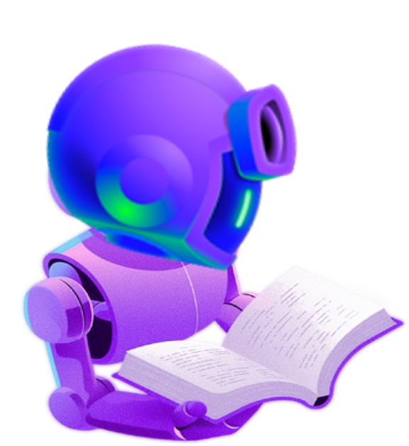

# 🧑‍🏫 The Expert

The Expert feels they must know everything about Python and answer every question. This mindset can lead to stress and burnout.

---

## 🧠 Why It Happens

Experts often set high standards for themselves and fear being seen as less knowledgeable. They believe they need to know everything before they can contribute or teach others.

> "The more I learn, the more I realize how much I don't know." - Albert Einstein

---

## 🌱 Growth Mindset

- **Embrace learning as a journey** - There's always something new to discover
- **Ask questions and seek help** - It's a sign of strength, not weakness
- **Share knowledge with others** - Teaching reinforces your own learning
- **It's okay to say "I don't know"** - Then add "but let's find out together"

---

## ➡️ Next: [The Perfectionist](the-perfectionist.md)
