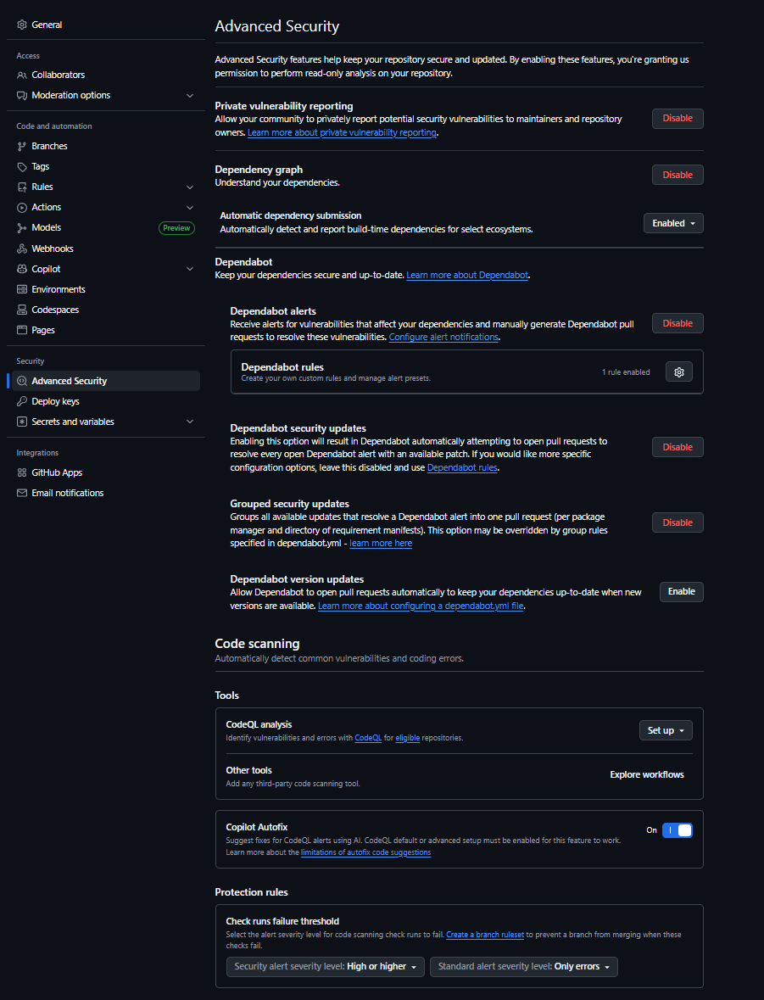

# 🦸 The Superperson

The Superperson tries to do it all - coding, teaching, leading, family, and more. This can lead to exhaustion and feeling overwhelmed.  

GitHub will actually take a lot of tasks off your hands. It can do all sorts of advanced security for you. GitHub’s security stack gives you end‑to‑end coverage: dependency graph + SBOM export for visibility; Dependabot alerts and automated security & version update PRs for detection and rapid remediation; the dependency review action and repository rulesets to prevent introducing known‑vulnerable or risky packages; secret scanning and push protection to stop credential leaks before they land; CodeQL/code scanning (when enabled) for static analysis of custom code; security policies, private vulnerability reporting, and advisories for coordinated disclosure; dashboards, audit trails, artifact attestations, and SBOMs for governance and provenance—all orchestrated to reduce upgrade friction (version currency), shrink mean time to patch, and give developers fast, actionable feedback directly in PRs.  

You don't have to do everything yourself. If you really can't do it all - then try GitHub Copilot in Agent Mode. It will do stuff for you. You won't learn as much using this mode - but it can help you when you run out of time and energy and brain cells... 🧠  

  
---

## 🧩 Finding Balance

- **Delegate tasks when possible** - You don't have to do everything alone
- **Set realistic goals** - Focus on what truly matters
- **Take breaks and recharge** - Burnout helps no one
- **Know your limits** - It's okay to say no sometimes
- **Prioritize self-care** - Your wellbeing comes first

.png)

> "You can do anything, but not everything." - David Allen

---

## ➡️ Next: [The Natural Genius](the-natural-genius.md)
